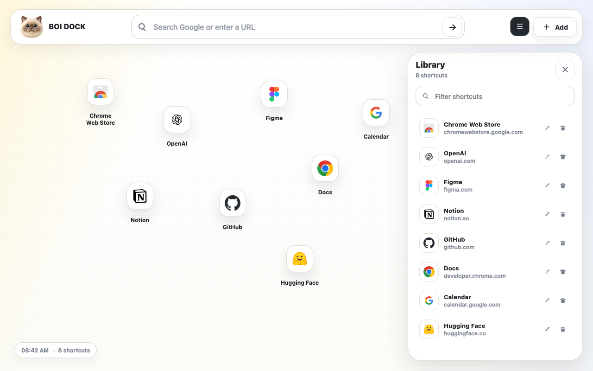
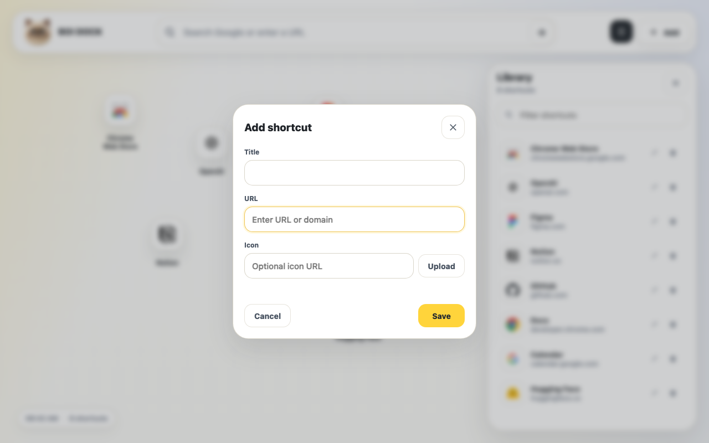

# BOI DOCK

[中文](README.zh-CN.md)

A freer Chrome new tab page.

Chrome's default new tab page is tidy, but rigid: fixed slots, fixed layout, fixed assumptions. BOI DOCK keeps the page quiet and gives the space back to you. Add as many shortcuts as you need, drag them anywhere, and overlap them if that is how your desk works.





## What It Does

- Adds unlimited shortcuts.
- Lets every shortcut move freely on the canvas.
- Allows overlapping shortcuts with no grid snapping.
- Searches Google or opens URLs directly from the top bar.
- Opens, filters, edits, deletes, and copies URLs from the library.
- Supports custom shortcut icons when a site's favicon is missing.
- Starts empty, without bundled default shortcuts.
- Switches between English and Chinese based on Chrome's UI language.

## Install

For local development:

1. Download or clone this repository.
2. Open `chrome://extensions/`.
3. Turn on `Developer mode`.
4. Click `Load unpacked`.
5. Select this project folder.

Open a new tab and BOI DOCK will replace Chrome's default new tab page.

## Development

```bash
npm install
npm test
```

The Playwright smoke test loads the extension with a temporary Chromium profile, so it does not touch your normal Chrome data.

## Privacy

BOI DOCK does not require an account and does not use a developer server. Shortcuts, positions, and library state are stored locally in `chrome.storage.local`.

Permissions:

- `storage`: saves shortcuts and layout.
- `clipboardWrite`: copies a shortcut URL when you click `Copy URL`.

Shortcut icons are loaded by domain through Google's favicon service unless you set a custom icon. Uploaded icons stay in local storage; custom icon URLs load from the URL you provide.

## License

MIT
