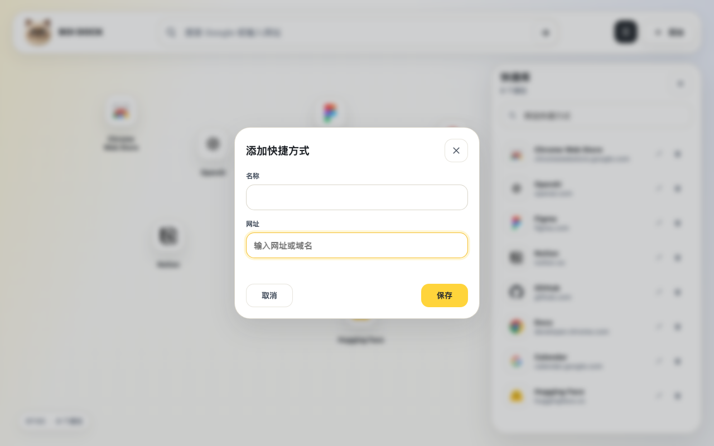

# BOI DOCK

BOI DOCK 是一个 Manifest V3 Chrome 新标签页扩展。它把 Chrome 默认新标签页换成一个轻量、干净、可以自由摆放的快捷访问 Dock。

Chrome 默认新标签页只有固定数量的快捷方式，BOI DOCK 的思路很简单：快捷方式不设应用层数量上限，每个图标都可以拖到任意位置，也可以重叠摆放。你决定自己的新标签页长什么样。


## 特性

- 快捷方式数量不设应用层上限，数据保存在 `chrome.storage.local`。
- 图标完全自由摆放，可以拖到画布任意位置。
- 允许图标重叠，不做网格吸附，也不强制自动排布。
- 顶部搜索框支持 Google 搜索，也支持直接输入网址跳转。
- 快捷库支持筛选、打开、编辑、删除和复制网址。
- 新安装默认没有任何快捷方式，用户自己决定添加什么。
- 白色卡片、暖黄色重点色、柔和动效，以及一只肥嘟嘟的 3D 重点色英短头像。

## 截图




## 本地安装

1. 克隆或下载这个仓库。
2. 打开 `chrome://extensions/`。
3. 开启右上角的 `Developer mode`。
4. 点击 `Load unpacked`。
5. 选择项目目录。
6. 打开一个新的 Chrome 标签页。

## 生成 Chrome Web Store 上传包和素材

```bash
npm install
npm run build:store
```

脚本会生成：

- `dist/boi-dock-0.1.0-chrome-web-store.zip`
- `store-assets/promos/small-promo-440x280.png`
- `store-assets/promos/marquee-promo-1400x560.png`
- `store-assets/screenshots/01-freeform-shortcuts-1280x800.png`
- `store-assets/screenshots/02-add-shortcut-1280x800.png`

## 测试

Playwright 冒烟测试会用临时 Chromium 用户数据目录加载 unpacked extension，不会修改你的日常 Chrome 配置。测试覆盖新标签页替换、默认空状态、裸域名添加、拖拽、复制网址、快捷库跳转和关键 UI 回归。

```bash
npm test
```

如果要指定 Chrome 可执行文件：

```bash
CHROME_PATH="/Applications/Google Chrome.app/Contents/MacOS/Google Chrome" npm test
```

## 项目结构

```text
.
├── app.js                         # 新标签页交互逻辑
├── manifest.json                  # Chrome 扩展清单
├── newtab.html                    # 新标签页页面
├── styles.css                     # UI 样式和动效
├── icons/                         # 扩展图标和猫猫头像
├── scripts/build-store-assets.mjs # 商店 ZIP 和宣传素材生成脚本
├── store-assets/                  # Chrome Web Store 素材
└── tests/extension.spec.mjs       # Playwright 扩展冒烟测试
```

## 权限说明

BOI DOCK 只申请必要权限：

- `storage`：保存用户添加的快捷方式、坐标、层级和快捷库开关状态。
- `clipboardWrite`：用户点击“复制网址”时，将对应网址写入剪贴板。

扩展不要求登录，不向开发者服务器发送数据，也不收集个人身份信息。快捷方式数据保存在用户本机。站点图标通过 Google favicon 服务按域名加载。

## License

MIT
